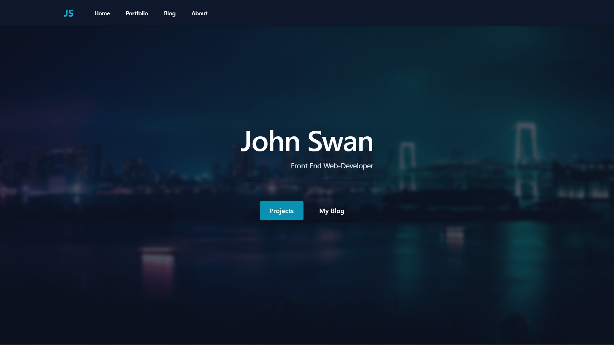
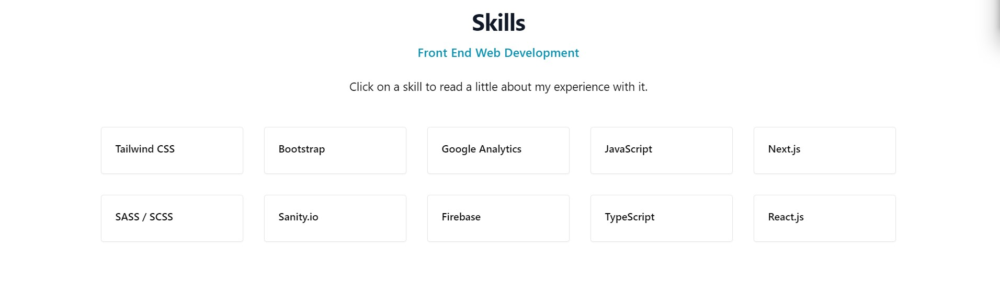
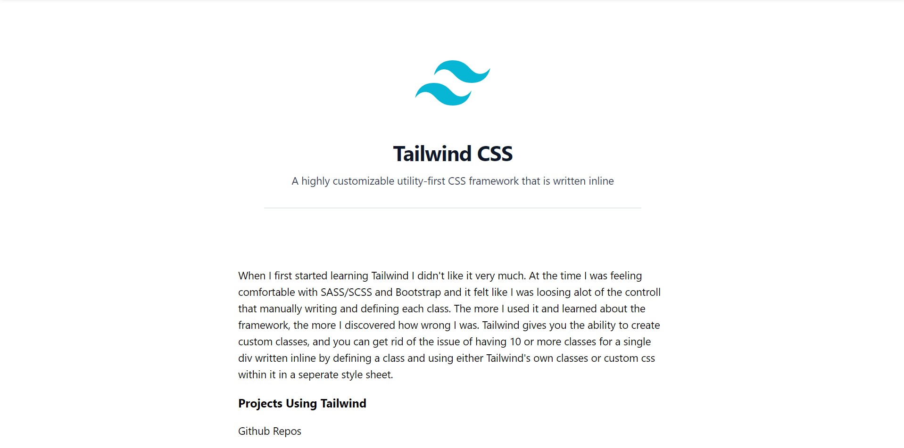
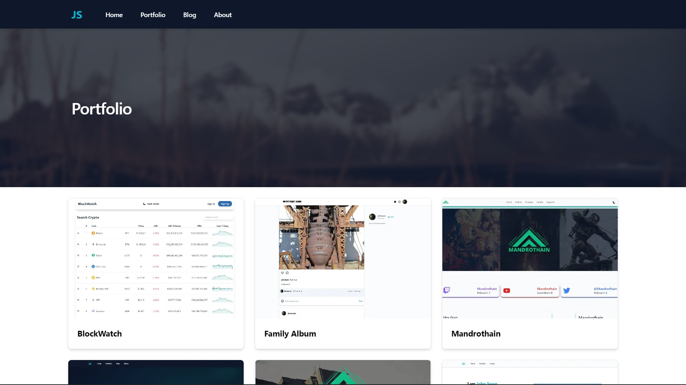
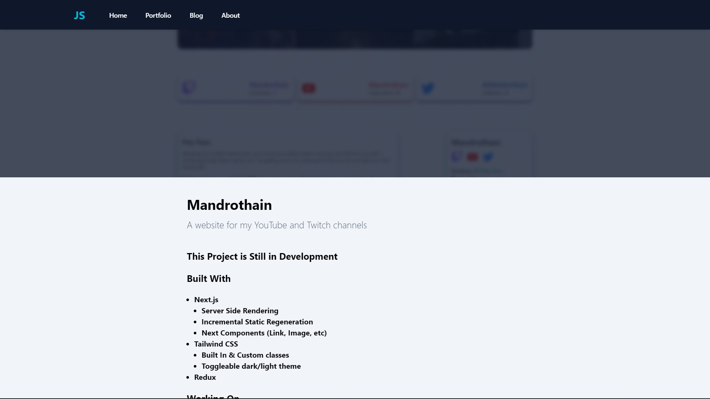
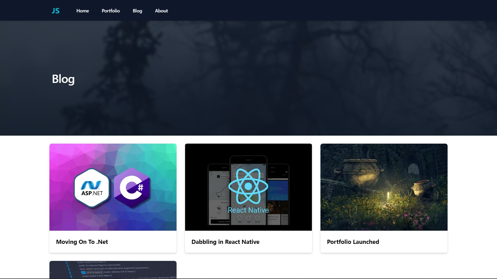
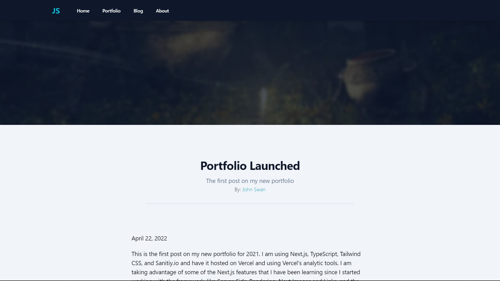
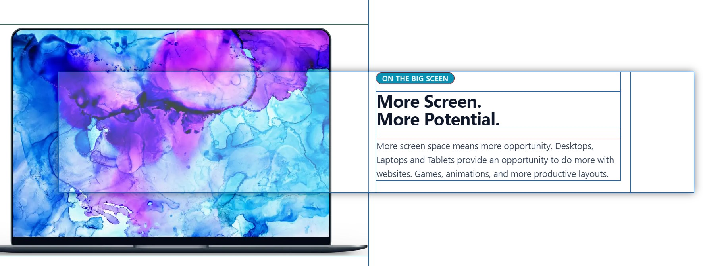

# Portfolio 2022

## Built With
* Next.js
  * Server Side Rendering
  * Incremental Static Regeneration
  * Next Components (Link, Image, etc)
* Tailwind CSS
* Sanity CMS
  * Projects
  * Skills
  * Blog
* TypeScript

# About This Project
My portfolio has gone through many iterations, and I am pretty happy with this one. A few things I might change later on are adjusting the project images to show both a desktop and mobile view mockup instead of just a screenshot, and I have a hard time deciding on the content on the home page, but I am happy with the styling for those components.
I built this project after spending a few weeks learning both Next.js and TypeScript, and figuring out the best ways to implement Sanity correctly while taking advantages of the features of Next.js was a pain but I landed on Incremental Static Regeneration to keep the CMS pages rendered on the server but able to be updated without reloading the whole application.

#### Sanity CMS
Sanity.io takes care of most of the content on the website. 
* The skills section of the home screen

* The Projects Section

* The Blog Section
  
  

## The Disgn
I wanted to give this website a modern feel and make use of banners throught the website. Each page, minus the skills pages, use a banner with a blurred filter on top. I don't like the way that scrolling animations look, but hover animations are great and add interactivity to elements, so I made use of those. I am particularly proud of the hover animations over the skills section.
I didn't want to go with a pure white background because other project screenshots blend in if they have a white background, so I went with a very light gray/slate. I am still unsure about the home page images with the phone and tablet, but I am happy with how they look.

## Current issues
* The home page banner doesn't show up correctly on Firefox after a recent browser update. It should be an easy fix.
* The div next to the laptop image sits on top of the image on desktop, so hover animation feels broken.
  * I only recently discovered the cause because of a Chrome extension called Pesticide which shows me this
  * 
* Loading can occasionally be slow still